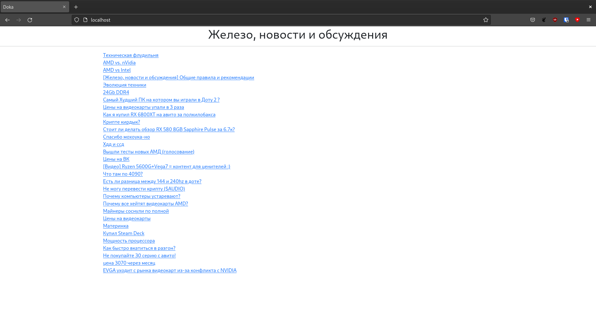

# Цели

Целью данной работы является создание HTTP-клиента и HTTP-сервера на языке Go.

# Задачи

В ходе выполнения лабораторной работы нужно разработать на языке Go HTTP-сервер,
который формирует динамические HTML-страницы на основе данных, получаемых с
указанного web-сервера. Детали задания приведены в таблицах ниже. Основные
требования к HTTP-серверу:
1. полная проверка данных, получаемых из сети (как от клиента, так и от
   web-сервера);
2. устойчивость к обрыву соединения;
3. возможность одновременного подключения нескольких клиентов к одному серверу;
4. сервер должен вести подробный лог всех ошибок, а также других важных событий
(установка и завершение соединения с клиентом, приём и передача сообщений, и т.
п.);
5. в зависимости от варианта список новостей должен быть стилизован и содержать,
в случае наличия на сайте-доноре, ссылки на первоисточник открывающейся в новом
окне, в случае наличия превью изображения к новости на сайте доноре, то это
изображение должно отображаться на реализовываемом HTTP-сервере.

Формирование списка тем из форума
https://dota2.ru/forum/forums/zhelezo-novosti-i-obsuzhdenija.166/

# Решение

`cmd/server/server.go`

```go
package main

import (
	"log"
	"net/http"
	"os"

	"github.com/stewkk/iu9-networks/lab2/internal/dota2ru"
	"github.com/stewkk/iu9-networks/lab2/internal/router"
)

func main() {
	logger := log.New(os.Stdout, "", log.Ldate|log.Ltime)
	mux := router.New(logger)

	dota2ru.RegisterHandlers(mux, dota2ru.NewService(), logger)

	address := "0.0.0.0:80"
	server := http.Server{
		Addr:    address,
		Handler: mux,
	}

	logger.Println("Slavatidika launched on", address)
	logger.Println(server.ListenAndServe())
	os.Exit(1)
}
```

`internal/dota2ru/api.go`

```go
package dota2ru

import (
	"fmt"
	"log"
	"net/http"
	"strconv"
	"text/template"

	"github.com/julienschmidt/httprouter"
	"github.com/stewkk/iu9-networks/lab2/internal/accesslog"
	"github.com/stewkk/iu9-networks/lab2/internal/errors"
)

func RegisterHandlers(mux *httprouter.Router, service Service, logger *log.Logger) {
	res := resource{service, logger}

	mux.GET("/", accesslog.Log(errors.Handle(res.handleGet, logger), logger))
	mux.GET("/:page", accesslog.Log(errors.Handle(res.handleGet, logger), logger))
}

type resource struct {
	service Service
	logger *log.Logger
}

func (res *resource) handleGet(w http.ResponseWriter, r *http.Request, p httprouter.Params) error {
	pageParam := p.ByName("page")
	if pageParam == "" {
		pageParam = "1"
	}
	page, err := strconv.Atoi(pageParam)
	if err != nil {
		return fmt.Errorf("%w: %v", errors.ErrPathParameter, err)
	}

	headings, err := res.service.ParseHeadings(page)
	if err != nil {
		return err
	}

	tmpl, err := template.New("Headings").Parse(`<!doctype html>
<html lang="en">
  <head>
    <meta charset="utf-8">
    <meta name="viewport" content="width=device-width, initial-scale=1">
    <title>Doka</title>
    <link href="https://cdn.jsdelivr.net/npm/bootstrap@5.2.2/dist/css/bootstrap.min.css" rel="stylesheet" integrity="sha384-Zenh87qX5JnK2Jl0vWa8Ck2rdkQ2Bzep5IDxbcnCeuOxjzrPF/et3URy9Bv1WTRi" crossorigin="anonymous">
  </head>
  <body>
	<div class="container text-center">
        <h1> Железо, новости и обсуждения </h1>
	</div>
	<hr>
	<div class="container-fluid text-start">
		{{range . }}
		<div class="row">
			<div class="col-2">
			</div>
			<div class="col-6">
				<a href="{{.Link}}">{{.Title}}</a>
			</div>
		</div>
		{{end}}
	</div>
<script src="https://cdn.jsdelivr.net/npm/bootstrap@5.2.2/dist/js/bootstrap.min.js" integrity="sha384-IDwe1+LCz02ROU9k972gdyvl+AESN10+x7tBKgc9I5HFtuNz0wWnPclzo6p9vxnk" crossorigin="anonymous"></script>
  </body>
</html>
`)

	tmpl.ExecuteTemplate(w, "Headings", headings)
	return nil
}
```

`internal/dota2ru/service.go`

```go
package dota2ru

import (
	"errors"
	"fmt"
	"net/http"
	"strconv"
	"strings"

	"golang.org/x/net/html"
)

// Service encapsulates usecase logic of dota2ru.
type Service interface {
	// ParseHeadings returns headings from dota2.ru forum.
	ParseHeadings(page int) ([]Heading, error)
}

// NewService returns new Service object.
func NewService() Service {
	return &service{}
}

var ErrServerStatusNotOK = errors.New("non-ok server status")

type service struct{}

func (s *service) ParseHeadings(page int) ([]Heading, error) {
	url := "https://dota2.ru/forum/forums/zhelezo-novosti-i-obsuzhdenija.166/"
	if page != 1 {
		url += "page-"
		url += strconv.Itoa(page)
	}

	resp, err := http.Get(url)
	if err != nil {
		return nil, fmt.Errorf("can't download webpage: %w", err)
	}
	defer resp.Body.Close()

	if resp.StatusCode != http.StatusOK {
		return nil, fmt.Errorf("%w: %v", ErrServerStatusNotOK, resp.Status)
	}

	doc, err := html.Parse(resp.Body)
	if err != nil {
		return nil, fmt.Errorf("can't parse webpage: %w", err)
	}

	var headings = make([]Heading, 0, 30)
	var f func(*html.Node) bool
	f = func(n *html.Node) bool {
		if n.Type == html.ElementNode && n.Data == "ul" && getAttr(n, "class") == "forum-section__list" {
			for c := n.FirstChild; c != nil; c = c.NextSibling {
				if c.Type == html.ElementNode && c.Data == "li" &&
					strings.Index(getAttr(c, "class"), "forum-section__item") != -1 &&
					strings.Index(getAttr(c, "class"), "forum-section__item--first") == -1 {

					titleBlock := getChild(getChild(getChild(c, "div", "forum-section__col-2"), "div", "forum-section__title"), "a", "forum-section__title-unlogged")
					link :=  "https://dota2.ru" + getAttr(titleBlock, "href")
					title := strings.TrimSpace(titleBlock.FirstChild.Data)

					headings = append(headings, Heading{
						Title: title,
						Link:  link,
					})
				}
			}
			return true
		}
		isFound := false
		for c := n.FirstChild; c != nil && !isFound; c = c.NextSibling {
			isFound = f(c)
		}
		return isFound
	}
	if !f(doc) {
		return nil, fmt.Errorf("webpage parse failed: can't find headings")
	}
	return headings, nil
}

func getAttr(n *html.Node, name string) string {
	for _, attr := range n.Attr {
		if attr.Key == name {
			return attr.Val
		}
	}
	return ""
}

func getChild(n *html.Node, block string, class string) *html.Node {
	for c := n.FirstChild; c != nil; c = c.NextSibling {
		if c.Type == html.ElementNode && c.Data == block && getAttr(c, "class") == class {
			return c
		}
	}
	return nil
}

// Heading represents forum thread heading.
type Heading struct {
	Title string
	Link  string
}
```

`internal/dota2ru/service_test.go`

```go
package dota2ru

import (
	"testing"

	. "gopkg.in/check.v1"
)

// Hook up gocheck into the "go test" runner.
func Test(t *testing.T) { TestingT(t) }

var (
	_ = Suite(&ServiceSuite{})
)

type ServiceSuite struct {
	service Service
}

func (s *ServiceSuite) SetUpSuite(c *C) {
	s.service = NewService()
}

func (s *ServiceSuite) TestParsesTitle(c *C) {
	headings, _ := s.service.ParseHeadings(1)
	c.Assert(headings[0].Title, Equals, `AMD vs. nVidia`)
}

func (s *ServiceSuite) TestParsesLink(c *C) {
	headings, _ := s.service.ParseHeadings(1)
	c.Assert(headings[0].Link, Equals, `https://dota2.ru/forum/threads/amd-vs-nvidia.998823/`)
}

func (s *ServiceSuite) TestParsesAllHeadings(c *C) {
	headings, _ := s.service.ParseHeadings(1)
	c.Assert(len(headings), Equals, 30)
}

func (s *ServiceSuite) TestParsesSecondPage(c *C) {
	headings, _ := s.service.ParseHeadings(2)
	c.Assert(headings[0].Title, Equals, `Компьютер вашей мечты`)
}
```

`internal/router/router.go`

```go
package router

import (
	"log"
	"net/http"

	"github.com/julienschmidt/httprouter"
	"github.com/stewkk/iu9-networks/lab2/internal/accesslog"
	"github.com/stewkk/iu9-networks/lab2/internal/errors"
)

// New returns preconfigured httprouter.Router.
func New(logger *log.Logger) *httprouter.Router {
	return &httprouter.Router{
		HandleMethodNotAllowed: true,
		NotFound: toStdHandler(accesslog.Log(errors.Handle(returnNotFound, logger), logger)),
		MethodNotAllowed: toStdHandler(accesslog.Log(errors.Handle(returnNotAllowed, logger), logger)),
	}
}

func returnNotFound(http.ResponseWriter, *http.Request, httprouter.Params) error {
	return errors.ErrNotFound
}

func returnNotAllowed(http.ResponseWriter, *http.Request, httprouter.Params) error {
	return errors.ErrNotAllowed
}

func toStdHandler(handler httprouter.Handle) http.Handler {
	return http.HandlerFunc(func(w http.ResponseWriter, r *http.Request) {
		handler(w, r, nil)
	})
}
```

`internal/errors/miidleware.go`

```go
package errors

import (
	"errors"
	"fmt"
	"log"
	"net/http"

	"github.com/julienschmidt/httprouter"
)

// Handler type represents handler that can return error. It's intended to be
// wrapped in error.Handle handler
type Handler func(http.ResponseWriter, *http.Request, httprouter.Params) error

// Handle creates middleware for handling errors and panics encountered during request handling
func Handle(handler Handler, logger *log.Logger) httprouter.Handle {
	return func(w http.ResponseWriter, r *http.Request, p httprouter.Params) {
		defer func() {
			if err := recover(); err != nil {
				logger.Println(err)
			}
		}()

		err := handler(w, r, p)
		if err != nil {
			logger.Println(err)
			errorResponse(w, err, logger)
		}
	}
}

func errorResponse(w http.ResponseWriter, err error, logger *log.Logger) {
	switch {
	case errors.Is(err, ErrNotFound):
		w.WriteHeader(http.StatusNotFound)
		fmt.Fprint(w, "Not found")
	case errors.Is(err, ErrNotAllowed):
		w.WriteHeader(http.StatusMethodNotAllowed)
		fmt.Fprint(w, "Method not allowed")
	case errors.Is(err, ErrPathParameter):
		w.WriteHeader(http.StatusBadRequest)
		fmt.Fprint(w, "Bad request")
	default:
		w.WriteHeader(http.StatusInternalServerError)
		fmt.Fprint(w, "Internal server error")
	}
}
```

`internal/errors/errors.go`

```go
package errors

import "errors"

var (
	ErrPathParameter = errors.New("path parameter error")
	ErrNotFound      = errors.New("not found")
	ErrNotAllowed    = errors.New("method not allowed")
	ErrServerStatusNotOK = errors.New("non-ok server status")
)
```

`internal/accesslog/accesslog.go`

```go
package accesslog

import (
	"log"
	"net/http"

	"github.com/julienschmidt/httprouter"
)

// Log middleware logs handled request.
func Log(handler httprouter.Handle, logger *log.Logger) httprouter.Handle {
	return func (w http.ResponseWriter, r *http.Request, p httprouter.Params) {
		logger.Println(r.Method, r.URL, r.Proto)
		handler(w, r, p)
	}
}
```

Пример работы

```bash
$ go run .
2022/10/10 15:08:27 Slavatidika launched on 0.0.0.0:80
2022/10/10 15:08:44 GET / HTTP/1.1
2022/10/10 15:08:46 GET /favicon.ico HTTP/1.1
2022/10/10 15:08:46 path parameter error: strconv.Atoi: parsing "favicon.ico": invalid syntax
^Csignal: interrupt
```


