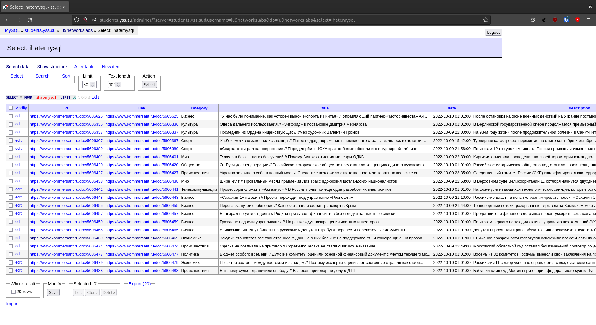

# Цели

Целью данной работы является разработка приложения выполняющего разбор RSS-ленты
новостей (по вариантам) и запись новостей в таблицу базы данных MySQL.

# Задачи

Приложение должно подключаться к удаленной базе данных под управленим СУБД MySQL
и выполнять обновление новостей в таблице.

http://www.kommersant.ru/RSS/main.xml

# Решение



`Makefile`

```Makefile
run:
	env $$(cat .env | xargs) go run cmd/feed/feed.go
```

`cmd/feed/feed.go`

```go
package main

import (
	"fmt"
	"os"

	"github.com/stewkk/iu9-networks/lab3/internal/kommersant"
)

func main() {
	news, err := kommersant.ParseFeed()
	if err != nil {
		fmt.Println(err)
		os.Exit(1)
	}

	err = kommersant.Store(news)
	if err != nil {
		fmt.Println(err)
		os.Exit(1)
	}
}

```

`internal/kommersant/entity.go`

```go
package kommersant

type NewsEntry struct {
	Id string
	Link string
	Category string
	Title string
	PubDate string
	Description string
}
```

`internal/kommersant/parse.go`

```go
package kommersant

import (
	"github.com/SlyMarbo/rss"
)

func ParseFeed() ([]NewsEntry, error) {
	feed, err := rss.Fetch("https://www.kommersant.ru/RSS/main.xml")
	if err != nil {
		return nil, err
	}

	var news []NewsEntry
	for _, entry := range feed.Items {
		news = append(news, NewsEntry{
			Id: entry.ID,
			Link:        entry.Link,
			Category:    entry.Categories[0],
			Title:       entry.Title,
			PubDate:     entry.Date.String(),
			Description: entry.Summary,
		})
	}
	return news, nil
}
```

`internal/kommersant/parse_test.go`

```go
package kommersant

import (
	"testing"

	. "gopkg.in/check.v1"
)

// Hook up gocheck into the "go test" runner.
func Test(t *testing.T) { TestingT(t) }

var (
	_ = Suite(&ParseSuite{})
)

type ParseSuite struct {
	news []NewsEntry
}

func (s *ParseSuite) SetUpSuite(c *C) {
	s.news, _ = ParseFeed()
}

func (s *ParseSuite) TestParsesFirstEntry(c *C) {
	c.Assert(s.news[0], DeepEquals, NewsEntry{
		Link:        "https://www.kommersant.ru/doc/5606469",
		Category:    "Экономика",
		Title:       "Закупки становятся все таинственнее // Данные о них больше не поддерживают ни конкуренцию, ни прозрачность",
		PubDate:     "2022-10-10 01:01:00 +0300 MSK",
		Description: "Снижение прозрачности госзакупок исключило возможности их содержательного анализа,"+
			" показало исследование «Контур.Торги». Данные третьего квартала свидетельствуют о "+
			"сокращении количества тендеров и участников в закупках как государства, так и госкомпаний. "+
			"Результат может быть вызван двумя принципиально разными причинами — перетоком части закупок в"+
			" невидимый для государства сектор или же снижением интереса бизнеса к госзаказу из-за "+
			"ужесточения в нем требований и расширения практик неконкурентных закупок. Статистика не "+
			"дает возможности определить, что именно происходит на этих рынках: принцип цифровизации "+
			"закупок для повышения их прозрачности и эффективности после начала военной "+
			"операции РФ на Украине, по существу, отменен.",
	})
}

func (s *ParseSuite) TestParsesAllEntries(c *C) {
	c.Assert(len(s.news), Equals, 20)
}
```

`internal/kommersant/store.go`

```go
package kommersant

import (
	"database/sql"
	"fmt"
	"os"

	_ "github.com/go-sql-driver/mysql"
)

var (
	DbUsername string
	DbPassword string
	DbAddress string
	DbName string
)

func init() {
	DbUsername = os.Getenv("DB_USER")
	DbPassword = os.Getenv("DB_PASS")
	DbAddress = os.Getenv("DB_ADDR")
	DbName = os.Getenv("DB_NAME")
}

func Store(news []NewsEntry) error {
	db, err := sql.Open("mysql", fmt.Sprintf("%s:%s@tcp(%s)/%s", DbUsername, DbPassword, DbAddress, DbName))
	if err != nil {
		return err
	}

	db.Exec(`DROP TABLE ihatemysql;`)

	_, err = db.Exec(`
CREATE TABLE IF NOT EXISTS ihatemysql(
id varchar(300) PRIMARY KEY,
link varchar(300),
category varchar(50) CHARACTER SET utf8mb4,
title varchar(150) CHARACTER SET utf8mb4,
date timestamp,
description text CHARACTER SET utf8mb4
);`)
	if err != nil {
		return err
	}

	insStmt, err := db.Prepare(`INSERT INTO ihatemysql VALUES(?, ?, ?, ?, ?, ?) ON DUPLICATE KEY UPDATE id=id`)
	if err != nil {
		return err
	}
	defer insStmt.Close()

	for _, entry := range news {
		_, err := insStmt.Exec(entry.Id, entry.Link, entry.Category, entry.Title, entry.PubDate, entry.Description)
		if err != nil {
			return err
		}
	}

	return nil
}
```
